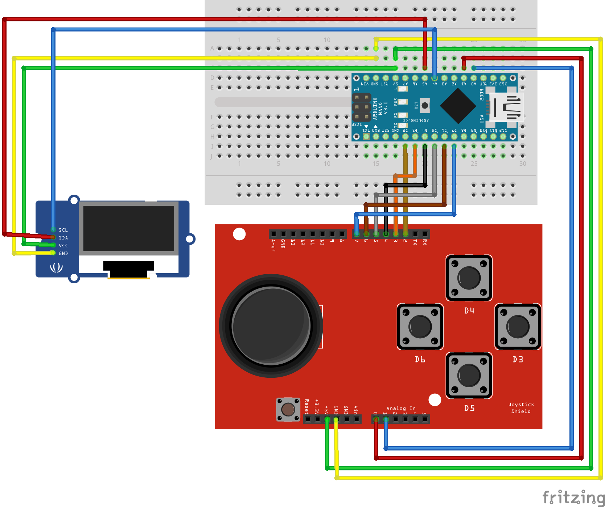

Vorbereiten der Hardware
========================

Bevor mit der Programmierung begonnen werden kann, muss zunächst die Hardware
vorbereitet werden

Benötigte Teile
---------------

Folgende Hardware wird vorausgesetzt:

- Ein Arduino Nano
- Ein Steckbrett, dass von der Größe her mit dem Nano kompatibel ist
- Einige Male-to-Male und Male-to-Female Steckkabel
- Ein USB zu Mikro-USB Kabel
- Ein Monochromes I2C-fähiges OLED-Display mit einer Auflösung von 128x64
  Pixeln (Hier verwendet: https://www.amazon.de/dp/B01L9GC470/)
- Ein Arduino Gamepad Shield (Hier verwendet: https://www.amazon.de/dp/B07CYZHRQT/)

Aufbau
------

Zuerst wird der Arduino Nano auf das Steckbrett gesteckt, sodass der Arduino
Nano auf der Lücke zwischen den Steckplatzreihen sitzt. Zu beiden Seiten sollten
zwei bis drei Steckplätze frei bleiben. 

Folgende Verbindungen müssen nun hergestellt werden (siehe Schaubild):

- Arduino GND zu Display GND
- Arduino 5V zu Display VCC
- Arduino A4 zu Display SDA
- Arduino A5 zu Display SCL
- Arduino 5V zu +5V auf dem Gamepad
- Arduino GND zu GND auf dem Gamepad
- Arduino A1 zu Analog In 1 auf dem Gamepad
- Arduino A0 zu Analog In 0 auf dem Gamepad
- Arduino D7 zu 7 auf dem Gamepad
- Arduino D6 zu 6 auf dem Gamepad
- Arduino D5 zu 5 auf dem Gamepad
- Arduino D4 zu 4 auf dem Gamepad
- Arduino D3 zu 3 auf dem Gamepad
- Arduino D2 zu 2 auf dem Gamepad

Nun lässt sich über die Analogen Pins A0 und A1 der Zustand des Analog-Sticks
bestimmen. Die digitalen Pins 2 bis 7 erfassen welche Knöpfe gedrückt werden.
Ein LOW Signal bedeutet, dass der Knopf gedrückt wird, ein HIGH Signal, dass er
nicht gedrückt wird.