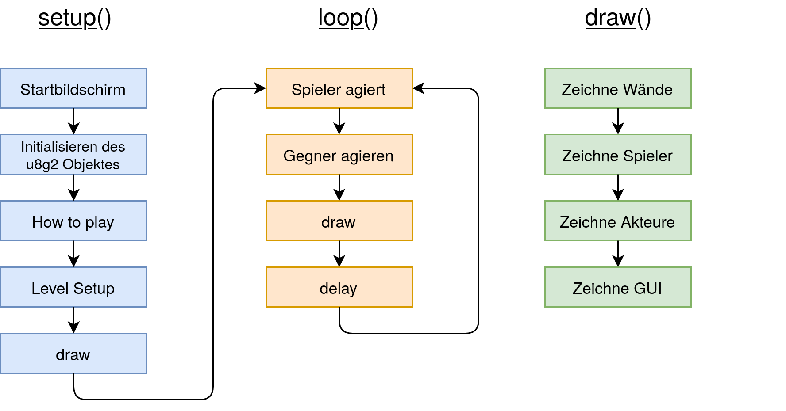
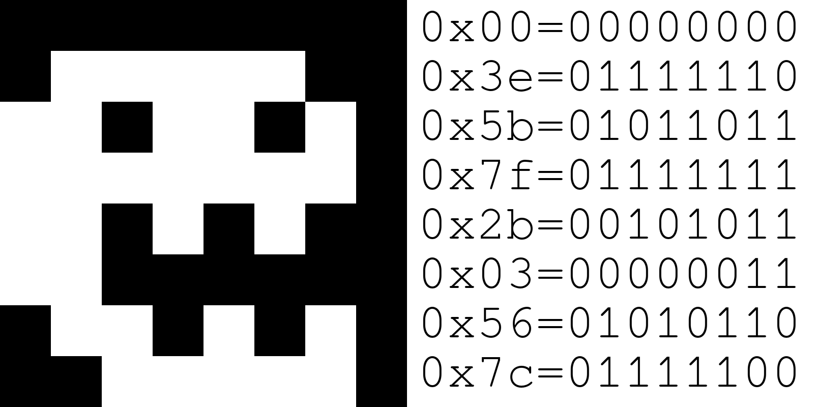
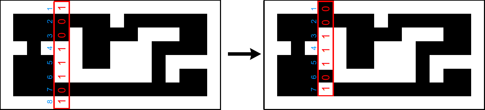

Programmieren des Arduino
=========================

In diesem Kapitel wird die grobe Struktur des Programmes erläutert. Details
befinden sich in den Kommentaren des Quellcodes.

Grobe Struktur
--------------

Zur besseren Übersicht sind im obigen Flussdiagramm die groben Strukturen der
drei wichtigsten Funktionen abgebildet.

Verwendung der u8g2 Library
---------------------------

Die u8g2 Library wird zum Ansteuern des OLED Displays verwendet. Dabei wird
sie zunächst zusammen mit der Wire Library eingebunden:

.. code-block:: c

  #include <U8g2lib.h>
  #include <Wire.h>

Zudem wird ein Objekt erzeugt, über das die benötigten Methoden auferufen
werden. Die Klasse des Objektes ändert sich je nach verwendetem Display und
gewünschter Buffer Größe und kann der dem Display beiliegenden Anleitung
entnommen werden.

.. code-block:: c

  //U8G2_SH1106_128X64_NONAME_F_HW_I2C u8g2(U8G2_R0, U8X8_PIN_NONE); // keep whole frame in buffer until cleared
  //U8G2_SH1106_128X64_NONAME_1_HW_I2C u8g2(U8G2_R0, U8X8_PIN_NONE); // keep only one page in buffer
  U8G2_SH1106_128X64_NONAME_2_HW_I2C u8g2(U8G2_R0, U8X8_PIN_NONE); // keep two pages in buffer

In diesem Projekt wird als Kompromiss zwischen Performanz und RAM-Verbrauch
die Klasse für den two-page-buffer verwendet.

Buffer und pages
^^^^^^^^^^^^^^^^

Um das Display effizient ansteuern zu können, muss
ein Abbild der einzelnen Pixel des Displays im RAM des Arduinos gespeichert
werden. Dies ist der Display Buffer. Wenn nun etwas dargestellt werden soll,
wird dieser Buffer an das Display gesendet, wo der Controller diesen Buffer
auswertet. Der Nachteil dieser Methode ist, dass 128*64 bit, also ungefähr ein
Kilobyte RAM dafür benötigt werden. Das ist bereits die Hälfte des zur
Verfügung stehenden Speichers, wenn man alle anderen von der Library
verwendeten Objekte und Variablen außer Acht lässt. Insgesamt wird so ohne
weiteren selbst geschriebenen Code ungefähr 80% des RAMs belegt.

Die hier verwendete Alternative basiert darauf, dass der Buffer in acht pages
eingeteilt wird und jeweils nur ein bzw. zwei pages auf einmal im
Arbeitsspeicher gehalten werden. Dies hat zwar den Nachteil, dass acht bzw.
vier Signale für jedes Erneuern des Displays versendet werden müssen, der
Zeitverlust ist für diesen Anwendungsfall aber glücklicherweise
vernachlässigbar.

Verwendete Methoden
^^^^^^^^^^^^^^^^^^^

Die in diesem Projekt verwendeten Methoden sind:

- ``firstPage()`` und ``nextPage()``: Werden zum Senden des Buffers verwendet
- ``setFont()``: Bestimmt die Schriftart der darzustellenden Texte. Die
  Schriftart bestimmt auch die Schriftgröße
- ``drawStr()``: Zeichnet einen Text an den angegebenen Koordinaten.
- ``drawDisc()``: Zeichnet einen ausgefüllten Kreis an den angegebenen
  Koordinaten
- ``drawCircle()``: Zeichnet einen leeren Kreis an den angegebenen Koordinaten
- ``drawBox()``: Zeichnet eine Box an den angegebenen Koordinaten
- ``drawFrame()``: Zeichnet einen Rahmen an den angegebenen Koordinaten
- ``drawHLine()``: Zeichnet eine Horizontale Linie an den angegebenen
  Koordinaten und mit der angegebenen Länge.
- ``drawXBM()``: Zeichnet ein Bild an den angegebenen Koordinaten. Als Argument
  wird eine Bitmap erwartet.
- ``setDrawColor()``: Legt fest, wie gezeichnet werden soll. Wird eine 0
  übergeben, werden Pixel durch ``draw`` Funktionen aus- statt eingeschaltet.
  1 ist der Standardwert.

Alle zur Verfügung stehenden Methoden können ebenfalls im offiziellen
Repository auf Github eingesehen werden: https://github.com/olikraus/u8g2/wiki/u8g2reference

Konkreter Anwendungsfall
^^^^^^^^^^^^^^^^^^^^^^^^

Ein Beispiel aus dem Code dieses Projektes:

.. code-block:: c

  u8g2.firstPage();
    do {
      u8g2.setFont(u8g2_font_tenfatguys_t_all);
      u8g2.drawStr(8,15,"How To Play");

      //[...]

    } while (u8g2.nextPage());

Mit dem Aufruf der Methode ``firstPage`` wird sichergestellt, dass mit dem
Übertragen der ersten page begonnen wird. Lässt man dies weg, wird unter
Umständen nur die letzte page bzw. die letzten beiden pages übertragen.
Der Aufruf der Methode ``nextPage`` bereitet das Übertragen der nächsten
(beiden) page(s) vor und gibt false zurück, wenn es keine weitere zu
übertragende page gibt.

Mit ``setFont`` wird eine Schriftart ausgewählt, die in diesem Fall neun Pixel
hoch ist.

Mit ``drawStr`` wird der Text "How To Play" an den Koordinaten (8|15)
dargestellt. Das Koordinatensystem hat oben links den Nullpunkt, die
Koordinaten geben die Position der unteren linken Ecke des Textes an.

Bitmaps
^^^^^^^
Die Bitmaps für Objekte und Akteure werden als unsigned char Arrays
gespeichert. Dabei steht jeder hexadezimale char für einen Byte in binär
(``0x2e`` z.B. entspricht ``00101110``) der wiederherum eine Zeile des
darzustellenden Bildes beschreibt. Jede Eins steht für einen "eingeschalteten"
Pixel, jede Null für einen "ausgeschalteten". Das Bit mit dem niedrigsten
Stellenwert wird links dargestellt, darauf folgende Bits werden rechts davon
angereiht.

So wird aus ``{0x00, 0x3e, 0x5b, 0x7f, 0x2b, 0x03, 0x56, 0x7c}`` folgendes
Bild:

Anzumerken ist an dieser Stelle noch, dass für dieses Projekt alle Sprites
(sprich: Bilder für Wände und Akteure) die obere Reihe und die rechte Spalte
der Bitmap ungenutzt lassen, um einen visuellen Unterschied zwischen
benachbarten Akteuren zu schaffen.

Bitmaps werden auch dafür verwendet die Positionen der Wände zu definieren.
Siehe dazu Abschnitt "Die Funktion draw()"

Eigene Funktionen und Strukturen
--------------------------------

Die Funktion isWall()
^^^^^^^^^^^^^^^^^^^^^
Diese Funktion gibt zurück, ob an einer angegebenen Position eine Wand steht.

Parameter
"""""""""
Diese Funktionen erwarten keine Parameter.

Funktionsweise
""""""""""""""
Vom aktuellen Level wird mit ``getWalls()[x]`` die Spalte passend zur
X-Koordinate genommen. Dieser Byte wird um die y-Koordinate geshiftet und mit
der binären 1 verundet. Das Ergebnis wird zurückgegeben.

Die Funktion getWalls()
^^^^^^^^^^^^^^^^^^^^^^^
Diese Funktion gibt die Wand-Bitmap für das aktuelle Level zurück.

Parameter
"""""""""
Diese Funktionen erwarten keine Parameter.

Funktionsweise
""""""""""""""
Mit einem einfachen switch/case Statement wird die passende Bitmap zum
aktuellen Level bestimmt und zurückgegeben.

Die Funktion getButtonPress()
^^^^^^^^^^^^^^^^^^^^^^^^^^^^^
Diese Funktion gibt zurück, ob ein angegebener Button gedrückt bzw. der
Joystick in eine bestimmte Richtung bewegt wird.

Parameter
"""""""""
- ``int button``: Die ID eines Buttons/einer Joystick-Richtung. Statt Zahlen zu
  übergeben sollten für die Lesbarkeit die Aliase verwendet werden, die zu
  Beginn der Projektdatei definiert wurden:

  .. code-block:: c

    #define BTN_UP        1
    #define BTN_DOWN      2
    #define BTN_LEFT      3
    //[...]

Funktionsweise
""""""""""""""
Durch ein switch statement wird eine Fallunterscheidung bezüglich der
verschiedenen Buttons/Richtungen des Joysticks vorgenommen. Hierbei ist zu
beachten, dass für Buttons ein ``digitalRead(Pin)`` ``true`` zurückgibt, wenn
der Button *nicht* gedrückt wird.

Die Zustände der beiden Achsen des Joysticks
werden über zwei analoge Pins abgefragt, die einen Wert von 0 bis 1023
zurückgeben. Ein Wert von ~512 bedeutet hierbei, dass der Joystick auf dieser
Achse nicht bewegt wird. Für die Nutzerfreundlichkeit werden leichte Bewegungen
des Joysticks (``analogRead(Pin)`` gibt einen Wert größer als 800 oder
kleiner als 200 zurück) nicht berücksichtigt.

Für die Richtungen, in die der Joystick gedrückt werden kann, wird zudem
berücksichtigt, dass kein Drücken in eine andere Richtung erfolgen darf. So
wird vermieden, dass sich der Spieler diagonal bewegt.

Der Spezialfall ``BTN_ANY`` gibt zurück, ob der Inventar-, Angriff- oder
Ruhe-Knopf gedrückt wird.

Die Funktion draw()
^^^^^^^^^^^^^^^^^^^^^^
Diese Funktionen wird mit jedem Durchlauf von ``loop()`` ausgeführt. Sie
verwendet die u8g2 Library um den aktuellen Zustand des Levels auf dem Display
darzustellen.

Parameter
"""""""""
Diese Funktion erwartet keine Parameter.

Funktionsweise
""""""""""""""
Der gesamte Inhalt der Funktion wird von dem im Abschnitt "Verwendung der u8g2
Library" beschriebenen do while Loop eingeschlossen, der nach und nach alle
pages an das Display überträgt.

In dem Loop werden zuerst die Wände des aktuellen Levels gezeichnet. Dies hat
den Vorteil, dass fehlpositionierte Akteure oder Spieler Charaktere nicht
überdeckt werden, was das Debugging vereinfacht. Dazu wird über die Bitmap des
aktuellen Levels, die durch ``getWalls()`` zur Verfügung steht, iteriert. Das
Vorgehen ist dabei das folgende:

Jeder Byte (char) stellt eine Spalte des aktuellen Levels dar. Das erste Bit
repräsentiert dabei die Y-Koordinate 0, das zweite die Y-Koordinate 1
usw. Durch das Nutzen eines bitweisen UNDs mit dem 1-char (0x01) kann
ausgelesen werden, ob das erste Bit eine 0 oder eine 1 enthält; entsprechend
wird an dieser Stelle eine Wand gezeichnet. Dann wird mit einem Bitshift nach
rechts das zweite Bit an die Position des ersten geschoben und erneut
ausgewertet. Nach sieben Bitshifts ist die gesamte Spalte ausgelesen und die
nächste kann betrachtet werden.

Im Anschluss an das Zeichnen der Wände wird die Position des Spielers
ausgelesen und an der entsprechenen Stelle dargestellt. Durch einen Loop über
das Array ``actors`` geschieht das gleiche mit jedem anderen Akteur.

Zum Schluss wird die GUI gezeichnet. Dafür wird mit einer horizontale Linie
der Spielbereich abgetrennt, und durch Symbole die aktuellen Lebenspunkte und
Leben dargestellt. Zwei loops zeichnen dafür in festen Abständen Kreise bzw.
Herzen.

Die Funktionen showStartScreen() und showHelpScreen()
^^^^^^^^^^^^^^^^^^^^^^^^^^^^^^^^^^^^^^^^^^^^^^^^^^^^^
Diese Funktionen werden zu Beginn des Spieles verwendet. Sie zeigen den
Startbildschirm und direkt danach eine kurze Erklärung der Steuerung.

Parameter
"""""""""
Diese Funktionen erwarten keine Parameter.

Funktionsweise
""""""""""""""
Beide Funktionen beinhalten eine Schleife für das wiederholte Darstellen der
jeweiligen Informationen. Dabei wird für den Startbildschirm mit jedem
Durchlauf der Schleife die Y-Position des Titels angepasst, sodass ein
"schwebender" visueller Effekt erzielt wird. Der von der Funktion
``showHelpScreen()`` erzeugt Hilfe-Bildschirm enthält blinkenden Text. Dies
wird dadurch realisiert, dass nicht bei jedem Durchlauf der Schleife der Text
angezeigt wird.

Die Funktion showDeathScreen()
^^^^^^^^^^^^^^^^^^^^^^^^^^^^^^
Diese Funktion wird aufgerufen, wenn der Spieler gestorben ist. Sie
informiert den Spieler über seinen Tod.

Parameter
"""""""""
Es wird erwartet, dass eine boolscher Wertes übergeben wird, der anzeigt,
ob der Spieler alle Leben verbraucht hat.

Funktionsweise
""""""""""""""
Die Funktion zeichnet die Wände des aktuellen Levels (siehe ``draw()``) und
darüber einen Rahmen mit der Nachricht "YOU DIED".

Sollte der Spieler sein letztes Leben verloren haben, so wird stattdessen
"GAME OVER" angezeigt und eine Animation abgespielt. Zudem werden die Werte des
Spielers (Leben, Rüstung etc.) zurückgesetzt.

Die Funktion showEndScreen()
^^^^^^^^^^^^^^^^^^^^^^^^^^^^
Diese Funktion wird aufgerufen, wenn der Spieler Level 4 erreicht. Sie zeichnet
den End Screen.

Parameter
"""""""""
Diese Funktion erwartet keine Parameter.

Funktionsweise
""""""""""""""
Die Funktion setzt anfangs alle Werte des Spielers zurück, damit nach Beenden
des Spieles erneut gespielt werden kann.

Im Anschluss werden Texte, die den Spieler beglückwünschen, angezeigt.

Drückt der Spieler einen Knopf, so werden ``showStartScreen()``,
``showHelpScreen()`` und ``setUpLevel()`` aufgerufen, und das Spiel beginnt von
vorn.

Die Funktion loop()
^^^^^^^^^^^^^^^^^^^
Diese Funktionen wird wiederholt ausgeführt, bis der Arduino abgeschaltet wird.

Sie ist bereits beim Erstellen eines Arduino Projektes vorhanden.

Parameter
"""""""""
Diese Funktion erwartet keine Parameter.

Funktionsweise
""""""""""""""
Zu Beginn jedes Durchlaufes wird darauf gewartet, dass der Spieler eine gültige
Eingabe tätigt. Dazu läuft eine while-Schleife ohne Inhalt solange durch,
bis die Funktion ``playerAct()`` true zurückgibt. Ist dies geschehen, so wird
für jeden Actor die Methode ``act()`` aufgerufen. Dies sorgt insgesamt dafür,
dass Akteure nur dann agieren, wenn auch der Spieler agiert hat. So wird der
Effekt einer rundenbasierten Spielweise erzielt, bei der der Spieler Zeit zum
Planen hat.

Im Anschluss wird mit dem Aufruf der Funktion ``draw()`` der Momentane Zustand
der Akteure und des Spielers auf dem Display dargestellt.

Durch ein ``delay(200)`` wird der nächste Aufruf von ``loop()`` verzögert,
damit ein Gedrückthalten des Joysticks den Spieler Charakter nicht
unkontrollierbar in eine Richtung bewegt.

Die Funktion setup()
^^^^^^^^^^^^^^^^^^^^
Diese Funktionen wird zu Beginn der Ausführung des Programmes ein einziges Mal
aufgerufen. Sie ist dafür gedacht, benötigte Libraries, Objekte und Ähnliches
vorzubereiten.

Sie ist bereits beim Erstellen eines Arduino Projektes vorhanden.

Parameter
"""""""""
Diese Funktion erwartet keine Parameter.

Funktionsweise
""""""""""""""
Zu Beginn wird der Zufallsgenerator des Arduino initialisiert und ein Seed
vergeben. Dies bewirkt, dass für jede Programmausführung die selbe Folge
"zufälliger" Zahlen generiert wird. Dies ist für das Debugging von
Akteur-Verhalten hilfreich.

Im Anschluss wird das Objekt u8g2 initialisiert. Es wird für die Kommunikation
mit dem Display gebraucht.

Nach dem Initialisieren werden die Funktionen zur Darstellung vom
Startbildschirm und zum Anzeigen der Steuerung aufgerufen. Hat der Benutzer
beide bestätigt, wird das erste Level als momentanes Level gesetzt und
``setUpLevel()`` aufgerufen, um das erste Level zu initialisieren.

Zum Schluss wird ``draw()`` aufgerufen um die Wände und Akteure anzuzeigen.

Die Funktion setUpLevel()
^^^^^^^^^^^^^^^^^^^^^^^^^
Initialisiert das aktuelle Level.

Parameter
"""""""""
Diese Funktion erwartet keine Parameter.

Funktionsweise
""""""""""""""
Zu Beginn wird player_haskey zurückgesetzt, damit der Spieler nach einem Tod
den Schlüssel nicht behält. Danach werden in einem großen switch/case-Statement
für jedes Level die Akteure und die Spielerposition gesetzt:

.. code-block:: c

  case 3:
  player_posx = 2;
  player_posy = 2;

  actors[0].setup(1, 3, 2); // key
  actors[1].setup(1, 6, 3); // door

Hat das momentane Level die ID 4, wird stattdessen der End Screen gezeigt.

Die Funktion playerAct()
^^^^^^^^^^^^^^^^^^^^^^^^
Diese Funktionen dient dem Verarbeiten des Spieler-Inputs. Sie gibt true oder
false zurück, je nachdem ob der Spieler eine Aktion erfolgreich durchgeführt
hat oder nicht.

Parameter
"""""""""
Diese Funktion erwartet keine Parameter.

Funktionsweise
""""""""""""""
Die Hauptstruktur der Funktion besteht aus mehreren if-else-Blöcken, die die
möglichen Tastendrücke/Joystickbewegungen des Spielers abfragen.

Für Bewegungen des Joysticks wird abgefragt, ob an der Zielkoordinate des
Spielers eine Wand vorhanden ist. Ist dem nicht so, wird die Position des
Spielers angepasst.

Drückt der Spieler den "ATTACK"-Button, so wird der Rückgabewert der Funktion
``playerAttack()`` zurückgegeben.

Drückt der Spieler den "INVENTORY"-Button, so wird das Inventar des Spieler
mithilfe der Funktion ``playerOpenInventory()`` geöffnet.

Drückt der Spieler den "REST"-Button, so wird kein zusätzlicher Code
ausgeführt, damit der Spieler eine Möglichkeit hat, seinen "Zug" zu
überspringen.

Die Funktion playerAttack()
^^^^^^^^^^^^^^^^^^^^^^^^^^^
Diese Funktion wird ausgeführt, wenn der Spieler angreift. Befinden sich Gegner
neben dem Spieler, erleiden sie Schaden.

Parameter
"""""""""
Diese Funktion erwartet keine Parameter.

Funktionsweise
""""""""""""""
Es wird über alle Akteure iteriert um
zu prüfen, welche (initialisierten) Akteure neben dem Spieler stehen. Steht ein
Akteur neben dem Spieler, so wird die Methoed ``takeDamage()`` des Akteurs
aufgerufen und die aktuelle Waffe des Spielers ``player_weapon`` übergeben.
Zudem wird die Methode ``blink()`` aufgerufen, die einen Akteur blinken lässt.
Sollte der Angriff allerdings
keinen Akteur treffen, so wird in einer gesonderten Überprüfung false
zurückgegeben.

Die aktuelle Waffe des Spielers ist ein integer, der über ein ``#define``
eingestanzt wird:

  .. code-block:: c

    #define WPN_HANDS 1
    #define WPN_SWORD 3
    #define WPN_MAGIC 5
    //[...]

Die Funktion damagePlayer()
^^^^^^^^^^^^^^^^^^^^^^^^^^^
Diese Funktion wird ausgeführt, wenn der Spieler angegriffen wird. Sie zieht
Leben ab und ruft ggf. ``showDeathScreen()`` auf.

Parameter
"""""""""
Diese Funktion erwartet den vom Gegner verursachten Schaden.

Funktionsweise
""""""""""""""
Der Rüstwert des Spielers wird vom zu verursachende Schaden abgezogen und dem
Spieler vom Leben abgezogen. Sinkt das Leben auf oder unter 0, so verliert der
Spieler ein Leben und der Death Screen wird angezeigt. Nach einem delay wird
das momentane Level erneut mit setUpLevel aufgebaut.

Die Funktion playerOpenInvenory()
^^^^^^^^^^^^^^^^^^^^^^^^^^^^^^^^^
Diese Funktion wird ausgeführt, wenn der Spieler das Inventar öffnet.

Parameter
"""""""""
Diese Funktion erwartet keine Parameter.

Funktionsweise
""""""""""""""
Zu Beginn der Funktion werden die Wände des aktuellen Levels gezeichnet
(siehe ``draw()``). Im Anschluss wird eine Box mit Rahmen dargestellt, in der
je nach aktuellem Wert von ``player_weapon`` und ``player_armour`` die Rüstung
und Waffe des Spielers als Text und als Bitmap gezeichnet werden.

Besitzt der Spieler einen Schlüssel, so wird zudem ein Schlüssel in der Ecke
des Inventars angezeigt.

Globale Variablen
^^^^^^^^^^^^^^^^^
Es werden mehrere globale Variablen verwendet, auf die alle Funktionen und
Methoden zugriff haben.

+-----------------------------------+----------------------+
|Variable                           |Verwendung            |
+-----------------------------------+----------------------+
|Actor actors[]                     |Enthält alle Akteure  |
|                                   |des aktuellen         |
|                                   |Levels.               |
|                                   |                      |
|                                   |Akteure des Typen 0   |
|                                   |gelten als nicht      |
|                                   |initialisiert und     |
|                                   |                      |
|                                   |                      |
|                                   |werden bei den        |
|                                   |meisten Abfragen      |
|                                   |ignoriert.            |
+-----------------------------------+----------------------+
|uint8_t cur_level                  |Enthält die Nummer    |
|                                   |des aktuellen         |
|                                   |Levels.               |
+-----------------------------------+----------------------+
|static unsigend char               |Enthält die Bitmap    |
|level_level<x>[]                   |für die Wände des     |
|                                   |x-ten Levels.         |
+-----------------------------------+----------------------+
|static unsigned char               |Ehtält die Bitmap     |
|sprite_<x>[]                       |für den Actor mit     |
|                                   |dem Namen x           |
+-----------------------------------+----------------------+
|uint8_t player_posx                |Enthalten die         |
|                                   |Koordinaten und       |
|uint8_t player_posy                |andere Spieler-Werte: |
|                                   |                      |
|                                   |Rüstung               |
|uint8_t player_weapon              |und Waffe werden als  |
|                                   |Zahl gespeichert,     |
|                                   |                      |
|uint8_t player_armour              |die zugleich ID und   |
|                                   |Schaden/Rüstwert      |
|uint8_t player_health              |ist. Leben und        |
|                                   |                      |
|                                   |Lebenspunkte werden   |
|uint8_t player_lives               |ebenfalls gespeichert,|
|                                   |                      |
|                                   |sowie ob der Spieler  |
|                                   |einen Schlüssel       |
|bool player_haskey                 |gefunden hat.         |
+-----------------------------------+----------------------+

Die Klasse/Struktur actor
^^^^^^^^^^^^^^^^^^^^^^^^^
Objekte dieser Klasse speichern Informationen zu den verschieden Akteuren in
einem Level wie etwa Items und Gegner.

Felder
""""""
Es werden mehrere Felder verwendet um Informationen zu einzelnen Instanzen
dieser Klasse zu speichern.

+--------------------+--------------------+
|Feld                |Verwendung          |
+--------------------+--------------------+
|uint8_t health      |Entspricht          |
|                    |dem verbleibenden   |
|                    |Leben des Gegners.  |
+--------------------+--------------------+
|uint8_t damage      |Entspricht          |
|                    |dem Schaden, den der|
|                    |Gegner verursacht   |
+--------------------+--------------------+
|uint8_t type        |Bestimmt das        |
|                    |Verhalten und das   |
|uint8_t subtype     |Aussehen des Actors.|
+--------------------+--------------------+
|uint8_t cur_x       |Die momentanen      |
|                    |Koordinaten des     |
|uint8_t cur_y       |Actors.             |
+--------------------+--------------------+
|uint8_t old_x       |Die Koordinaten des |
|                    |Actors im           |
|uint8_t old_y       |vorangegangenen Zug.|
|                    |Wird verwended,     |
|                    |                    |
|                    |um                  |
|                    |das Verhalten besser|
|                    |steuern zu können.  |
+--------------------+--------------------+

Die Methode actor.setup()
"""""""""""""""""""""""""
Diese Funktion erleichtert das Initialisieren eines Actors, da alle wichtigen
Felder auf einmal gesetzt werden können.

**Paramter**

Folgende Parameter werden erwartet:

* ``uint8_t x``: X-Koordinate des Akteurs
* ``uint8_t y``: Y-Koordinate des Akteurs
* ``uint8_t type``: Typ des Akteurs
* ``uint8_t subtype``: Untertyp des Akteurs, standardmäßig 0

**Funktionsweise**

Setzt die entsprechenden Felder auf die übergebenen Werte. Das Feld ``health``
wird je nach Typ anders gesetzt.

Die Funktion getSprite()
""""""""""""""""""""""""
Diese Funktionen gibt die passende Bitmap zu dem übergeben Akteur zurück.

**Parameter**

Es werden keine Parameter erwartet.

**Funktionsweise**

Durch ein simples switch-case Statement wird je nach Typ des Akteurs die
passende Bitmap zurückgegeben. Sollte kein case zutreffen, wird eine spezielle
Bitmap zurückgegeben, die signalisiert, dass keine passende Textur zu dem Typen
existiert.

.. image:: images/nosprite.png
  :width: 100
  :alt: Fehlender Sprite

Die Methode actor.takeDamage()
""""""""""""""""""""""""""""""
Diese Funktion berechnet das Leben des Actors nach einem Angriff des Spielers

**Paramter**

* ``int damage``: Der zu erleidende Schaden

**Funktionsweise**

``damage`` wird von ``health`` abgezogen. Sollte dies einen negativen Wert oder
0  ergeben, so wird der Typ des Actors auf 0 gesetzt. Ruft zudem ``blink()``
auf, und ``draw()``, falls der Akteur keine Lebenspunkte mehr hat. Letzteres
ist wichtig, da bei einem Neuzeichnen des Spielfeldes der Gegner sofort
statt erst im nächsten Zug verschwindet.

Die Methode blink()
"""""""""""""""""""
Diese Funktionen lässt den Akteur blinken.

**Parameter**

Es werden keine Parameter erwartet.

**Funktionsweise**

In einer for-Schleife wird der Typ des Akteurs wiederholt auf 0 und zurück auf
den originalen Typen gesetzt. Da bei jedem Wechsel die ``draw()`` Funktion
aufgerufen wird, die Akteure vom Typen 0 nicht zeichnet, entsteht ein
blinkender Effekt.

Die Methode actor.setPosition()
"""""""""""""""""""""""""""""""
Diese Funktion setzt die absolute Position eines Actors.

**Paramter**

Folgende Parameter werden erwartet:

* ``uint8_t new_x``: Die neue X-Koordinate
* ``uint8_t new_y``: Die neue Y-Koordinate

**Funktionsweise**

``cur_x, cur_y, old_x, old_y`` werden entsprechend der übergebenen Werte neu
gesetzt.

Die Methode actor.move()
"""""""""""""""""""""""""""""""
Diese Funktion setzt die Position eines Actors relativ zur momentanen Position.

**Paramter**

Folgende Parameter werden erwartet:

* ``int8_t x_offset``: Der Wert, um die der Akteur auf der X-Achse verschoben
  werden soll
* ``int8_t y_offset``: Der Wert, um die der Akteur auf der Y-Achse verschoben
  werden soll

**Funktionsweise**

``cur_x, cur_y, old_x, old_y`` werden entsprechend der übergebenen Werte neu
gesetzt, wenn sich keine Wand an der neuen Position befindet. Kann sich der
Akteur an die neue Position bewegen, so wird true zurückgegeben, andernfalls
false.

Die Methoden actor.moveLeft(), actor.moveRight(), actor.moveAhead(), actor.moveBack()
"""""""""""""""""""""""""""""""""""""""""""""""""""""""""""""""""""""""""""""""""""""
Diese Funktionen sind Kurzschreibweisen von ``actor.move()``. Die
Richtungsanweisungen sind relativ zur momentanen Bewegungsrichtung.

**Paramter**

Es werden keine Parameter erwartet.

**Funktionsweise**

Ruft die Methode ``actor.move()`` auf. Dabei werden die momentane und die
vorherige Position so übergeben, dass sich die Richtung (z.B. "Ahead") auf die
aktuelle Bewegungsrichtung bezieht. Das Bedeutet, dass ein ``actor.moveAhead()``
den Actor ein Feld nach oben versetzt, wenn sein vorherige Position ein Feld
unter der aktuellen liegt.

Die Methoden actor.wallLeft(), actor.wallRight(), actor.wallAhead()
"""""""""""""""""""""""""""""""""""""""""""""""""""""""""""""""""""
Diese Funktionen sind Kurzschreibweisen von ``isWall()``. Die
Richtungsanweisungen sind relativ zur momentanen Bewegungsrichtung.

**Paramter**

Es werden keine Parameter erwartet.

**Funktionsweise**

Es wird zurückgegeben ob sich in der entsprechenden Richtung eine Wand
befindet. So returniert ``actor.wallLeft()`` true, wenn links des Actors eine
Wand ist. Bestimmt wird dies mithilfe der Funktion ``isWall()``. So wie bei den
Methoden ``actor.moveX()`` sind die Richtungen relativ zur momentanen
Bewegungsrichtung zu verstehen.

Die Methode actor.act()
"""""""""""""""""""""""
Diese Funktionen wird nach jeder erfolgreichen Aktion des Spielers aufgerufen
und dafür genutzt, Verhalten von Actors festzulegen. So wird hier zum Beispiel
das Bewegungsmuster des Skull-Gegners definiert.

**Paramter**

Es werden keine Parameter erwartet.

**Funktionsweise**

Zu Beginn wird der Typ des Actors abgefragt. Ist dieser vom Typ vier, also dem
Skull-Gegner, so wird eine Fallunterscheidung vorgenommen:

#) Befindet sich der Spieler ein Feld neben dem Akteur, so wird
   ``damagePlayer()`` aufgerufen.

#) Ist das nicht der Fall und ist die aktuelle Position gleich der vorherigen
   Position, so wird im
   Uhrzeigersinn von Rechts ausgehend versucht, ein Feld voranzuschreiten.
   Dies geschieht unter Verwendung der ``move()`` Methode, da ``moveRight()``
   und Ähnliches ohne eine vorherige Position nicht funktioniert.

#) Ist keiner der obrigen Fälle eingetreten, so bewegt sich der Skull-Gegner
   nach folgendem Muster:

   - Sind zwei Wände vor oder seitlich vom Gegner, bewegt er sich in die
     verbleibende Richtung. Sollte das nicht möglich sein, dreht er um.

     Beispiel: Links und vor dem Gegner ist eine Wand. Er versucht sich nach
     rechts zu bewegen. Schlägt das fehl, geht er einen Schritt zurück.

   - Ist eine Wand vor oder seitlich vom Gegner, wählt er per Zufall eine der
     beiden Richtungen aus und bewegt sich dorthin.

   - Ist keine Wand vor oder seitlich vom Gegner, wählt er per Zufall eine der
     Richtungen aus und bewegt sich dorthin.

   - Es muss nicht berücksichtigt werden, ob sich hinter dem Gegner eine Wand
     befindet, da er aus dieser Richtung kommt. Ist er von Wänden umgeben,
     greift Abfrage 2)

Ist der Akteur vom Typ zwei, also ein Schlüssel, so wird geprüft, ob sich
der Spieler an der aktuellen Position des Schlüssels befindet. Ist das der
Fall, so wird der Typ des Akteurs auf 0 gesetzt und ``player_haskey`` auf true.

Ist der Akteur vom Typ drei, also eine Tür, so wird geprüft, ob sich der
Spieler an der aktuellen Position der Tür befindet und einen Schlüssel hat. Ist
das der Fall, so wird ``player_haskey`` auf false gesetzt, ``cur_level``
inkrementiert und ``setUpLevel()`` aufgerufen.

Ist der Akteur vom Typ 6, also ein Geister-Gegner, so wird eine
Fallunterscheidung vorgenommen:

#) Befindet sich der Spieler ein Feld neben dem Akteur, so wird
   ``damagePlayer()`` aufgerufen.

#) Ist das nicht der Fall und ist die aktuelle Position gleich der vorherigen
   Position, so wird nach ``subtype`` unterschieden. Subtyp 1 bewegt sich nach
   unten, subtyp 0 nach oben. Dies legt die Startrichtung der Geister fest,
   die um einen Bereich kreisen sollen.

#) Ist keiner der obrigen Fälle eingetreten, so wird geprüft, ob sich der Geister
   nach vorne bewegen kann, ansonsten biegt er nach links ab.

Insgesamt entsteht so für die Geister eine Kreisbewegung um eine freie Fläche
in der Mitte.

Ist der Akteur vom Typ 5, 7, 8 oder 9, also ein Ausrüstungsgegenstand, so wird
geprüft, ob sich der Spieler an der aktuellen Position des Akteurs befindet.
Ist das der Fall, wird ``player_armour`` bzw. ``player_weapon`` auf die
entsprechende ID gesetzt (mittels der ``#define``-Aliase)